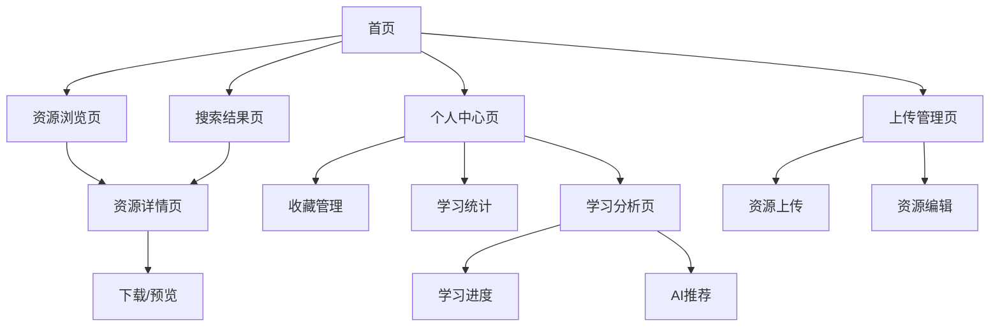

## 1. Product Overview
One Piece 是一个专为校园设计的真题与课设仓库平台，致力于让学习资源触手可及，让知识传承更简单。
- 解决校园学习资源分散、获取困难的问题，为学生提供统一的资源获取平台，帮助学生高效备考和学习。
- 目标成为校园内最全面、最便捷的学习资源共享平台，提升整体学习效率和知识传承质量。

## 2. Core Features

### 2.1 User Roles
| Role | Registration Method | Core Permissions |
|------|---------------------|------------------|
| 普通用户 | 默认访问 | 浏览、搜索、下载资源，收藏资料 |
| 管理员用户 | 管理员权限 | 上传、编辑、删除资源，用户管理 |

### 2.2 Feature Module
我们的校园资源平台包含以下核心页面：
1. **首页**: 平台概览、统计数据展示、快速搜索入口、特色功能标签
2. **资源浏览页**: 资源列表展示、筛选功能、分类浏览、排序选项
3. **资源详情页**: 详细信息展示、在线预览、下载功能、相关推荐
4. **搜索结果页**: 搜索结果展示、高级筛选、搜索建议、历史记录
5. **个人中心页**: 用户信息、收藏管理、下载历史、学习统计
6. **上传管理页**: 资源上传、编辑管理、审核状态、批量操作
7. **学习分析页**: 学习进度、成绩分析、知识图谱、推荐系统

### 2.3 Page Details
| Page Name | Module Name | Feature description |
|-----------|-------------|---------------------|
| 首页 | 平台概览区 | 展示平台标题、副标题、核心价值主张，包含渐变动画效果 |
| 首页 | 统计数据卡片 | 显示试卷数量、代码项目数量、用户数量等关键指标，支持悬停动画 |
| 首页 | 快速搜索栏 | 提供智能搜索功能，支持搜索建议、历史记录、热门搜索 |
| 首页 | 特色标签区 | 展示平台特色功能标签，如零后端成本、快速上线、开源免费 |
| 资源浏览页 | 筛选工具栏 | 按课程、年份、学期、教师、资源类型进行筛选 |
| 资源浏览页 | 资源卡片列表 | 展示资源缩略图、基本信息、操作按钮（预览、下载、收藏） |
| 资源浏览页 | 管理员操作 | 编辑、删除资源功能，仅管理员可见 |
| 资源浏览页 | 分页导航 | 支持页码跳转、每页数量设置 |
| 资源详情页 | 资源信息展示 | 显示详细的课程信息、教师信息、上传时间、下载统计 |
| 资源详情页 | 在线预览 | PDF文件在线预览，代码项目GitHub链接跳转 |
| 资源详情页 | 下载功能 | 支持单文件下载，统计下载次数 |
| 资源详情页 | 相关推荐 | 基于课程、类型推荐相关资源 |
| 搜索结果页 | 搜索结果列表 | 展示搜索匹配的资源，支持关键词高亮 |
| 搜索结果页 | 高级筛选 | 在搜索结果基础上进一步筛选 |
| 搜索结果页 | 搜索建议 | 提供搜索纠错、相关搜索建议 |
| 个人中心页 | 用户信息管理 | 查看和编辑个人基本信息 |
| 个人中心页 | 收藏管理 | 查看、分类管理收藏的资源 |
| 个人中心页 | 下载历史 | 查看历史下载记录，支持重新下载 |
| 个人中心页 | 学习统计 | 展示学习时长、下载统计、活跃度分析 |
| 上传管理页 | 资源上传 | 支持试卷PDF和代码项目上传，表单验证 |
| 上传管理页 | 资源编辑 | 修改资源信息、更新文件 |
| 上传管理页 | 批量操作 | 支持批量删除、批量编辑 |
| 学习分析页 | 学习进度跟踪 | 记录和展示学习进度，课程完成度 |
| 学习分析页 | 成绩分析 | 基于下载和学习行为的成绩预测分析 |
| 学习分析页 | 知识图谱 | 展示课程间关联关系，学习路径推荐 |
| 学习分析页 | AI推荐系统 | 基于学习行为的个性化资源推荐 |

## 3. Core Process

**普通用户流程：**
用户访问首页 → 浏览平台概览和统计 → 使用搜索或筛选功能查找资源 → 查看资源详情 → 在线预览或下载资源 → 收藏感兴趣的资源 → 在个人中心管理收藏和查看学习统计

**管理员流程：**
管理员登录 → 访问上传管理页面 → 上传新资源或编辑现有资源 → 审核和管理用户上传的内容 → 查看平台使用统计 → 优化资源分类和推荐算法

**学习分析流程：**
用户学习行为数据收集 → 学习进度自动跟踪 → 生成个性化学习报告 → AI分析学习模式 → 推荐相关学习资源 → 提供学习路径建议

## 4. User Interface Design

### 4.1 Design Style
- **主色调**: 紫色渐变系列 (#7C3AED, #8B5CF6, #A855F7)，辅助色包括蓝色 (#3B82F6) 和绿色 (#10B981)
- **按钮样式**: 圆角设计，支持渐变背景和悬停动画效果，采用现代扁平化风格
- **字体**: 系统默认字体栈，标题使用较大字号 (text-2xl 到 text-7xl)，正文使用适中字号 (text-sm 到 text-lg)
- **布局风格**: 卡片式布局，采用玻璃拟态效果 (glass-effect)，顶部导航栏固定，响应式网格系统
- **图标风格**: 使用 Lucide React 图标库，线性风格，支持动画效果

### 4.2 Page Design Overview

| Page Name | Module Name | UI Elements |
|-----------|-------------|-------------|
| 首页 | 平台概览区 | 大标题采用紫色渐变文字效果，背景模糊光晕，居中对齐布局 |
| 首页 | 统计数据卡片 | 玻璃拟态卡片，圆角设计，悬停缩放动画，渐变图标背景 |
| 首页 | 快速搜索栏 | 圆角输入框，搜索图标，下拉建议框，支持键盘快捷键 |
| 首页 | 特色标签区 | 彩色渐变背景标签，圆角设计，图标+文字组合 |
| 资源浏览页 | 筛选工具栏 | 水平排列的筛选按钮，选中状态高亮，下拉选择器 |
| 资源浏览页 | 资源卡片 | 网格布局，卡片阴影效果，悬停动画，操作按钮浮层显示 |
| 资源详情页 | 信息展示区 | 左右分栏布局，左侧预览区，右侧信息区，标签式分类显示 |
| 个人中心页 | 导航标签 | 水平标签导航，选中状态下划线动画，内容区域切换 |
| 上传管理页 | 表单区域 | 分步骤表单，进度指示器，拖拽上传区域，实时验证反馈 |
| 学习分析页 | 数据可视化 | 图表组件，进度条，环形统计图，交互式知识图谱 |

### 4.3 Responsiveness
平台采用移动优先的响应式设计，支持桌面端、平板和手机端适配。针对触屏设备优化了按钮大小和交互体验，确保在各种设备上都能提供良好的用户体验。导航栏在移动端采用汉堡菜单设计，卡片布局自适应屏幕宽度。