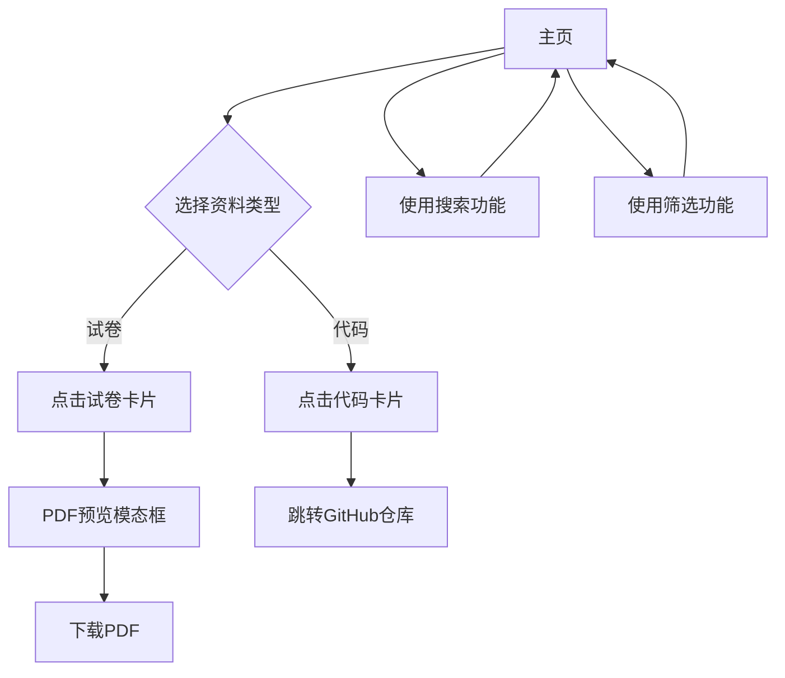

## 1. 产品概述

校园真题与课设仓库是一个基于现代 Jamstack 架构的校园内部应用，旨在将历届课程的真题（PDF）与课程设计（代码仓库）集中到一个可搜索、可预览、一键访问的极简网站。
- 解决问题：校园内真题和课设资料分散、难以查找和访问的问题
- 目标用户：在校学生、课程助教、任课老师
- 产品价值：实现零后端成本、零预算启动、1天快速上线的高效解决方案

## 2. 核心功能

### 2.1 用户角色

| 角色 | 访问方式 | 核心权限 |
|------|----------|----------|
| 默认用户 | 直接访问网站 | 可浏览、搜索、预览、下载真题，访问代码仓库 |
| 贡献者 | GitHub账号 | 可通过PR提交新资料和更新元数据 |

### 2.2 功能模块

我们的校园真题与课设仓库包含以下主要页面：
1. **主页**：搜索栏、筛选条、资料卡片网格
2. **PDF预览页**：PDF查看器、下载功能
3. **代码仓库跳转**：直接跳转到GitHub仓库

### 2.3 页面详情

| 页面名称 | 模块名称 | 功能描述 |
|----------|----------|----------|
| 主页 | 搜索栏 | 支持课程名称、教师、资料类型的模糊搜索 |
| 主页 | 筛选条 | 按年份、学期、类型、内容（试卷/代码）快速筛选 |
| 主页 | 资料卡片网格 | 响应式瀑布流布局，展示试卷和代码项目卡片 |
| 主页 | 试卷卡片 | 显示课程信息、悬浮预览缩略图、点击弹出模态框 |
| 主页 | 代码卡片 | 显示项目信息、GitHub Logo、点击跳转仓库 |
| PDF预览页 | PDF查看器 | 使用react-pdf组件渲染PDF内容 |
| PDF预览页 | 下载功能 | 通过Edge Function安全下载PDF文件 |
| 代码仓库跳转 | 外部链接 | 新标签页打开GitHub仓库地址 |

## 3. 核心流程

**主要用户操作流程：**

用户访问网站后，可以通过搜索栏输入关键词或使用筛选条快速定位所需资料。对于试卷类资料，用户点击卡片后会弹出模态框进行PDF预览，并可选择下载；对于代码类资料，用户点击卡片直接跳转到对应的GitHub仓库页面。

**贡献者流程：**

贡献者通过Fork主仓库，上传PDF文件到指定目录或修改index.json添加代码项目信息，然后提交Pull Request等待审核合并。

## 4. 用户界面设计

### 4.1 设计风格

- **主色调**：深色模式主题，主色为深蓝色(#1a1a2e)，辅助色为紫色(#16213e)
- **按钮样式**：现代圆角按钮，带有微妙的阴影效果
- **字体**：系统默认字体栈，标题使用18-24px，正文使用14-16px
- **布局风格**：响应式瀑布流网格布局，卡片式设计
- **图标风格**：使用简洁的线性图标，GitHub Logo用于代码项目标识

### 4.2 页面设计概览

| 页面名称 | 模块名称 | UI元素 |
|----------|----------|--------|
| 主页 | 搜索栏 | 居中放置，圆角输入框，搜索图标，占位符文本 |
| 主页 | 筛选条 | 水平排列的标签按钮，选中状态高亮显示 |
| 主页 | 资料卡片 | 圆角卡片，阴影效果，悬浮动画，试卷卡片显示缩略图 |
| PDF预览页 | 模态框 | 全屏覆盖，深色背景，白色内容区域，关闭按钮 |
| PDF预览页 | PDF查看器 | 居中显示，支持缩放和翻页，加载动画 |

### 4.3 响应性设计

产品采用移动优先的响应式设计，在桌面端显示3-4列网格布局，平板端显示2列，移动端自动收缩为单列布局，确保在各种设备上都有良好的用户体验。